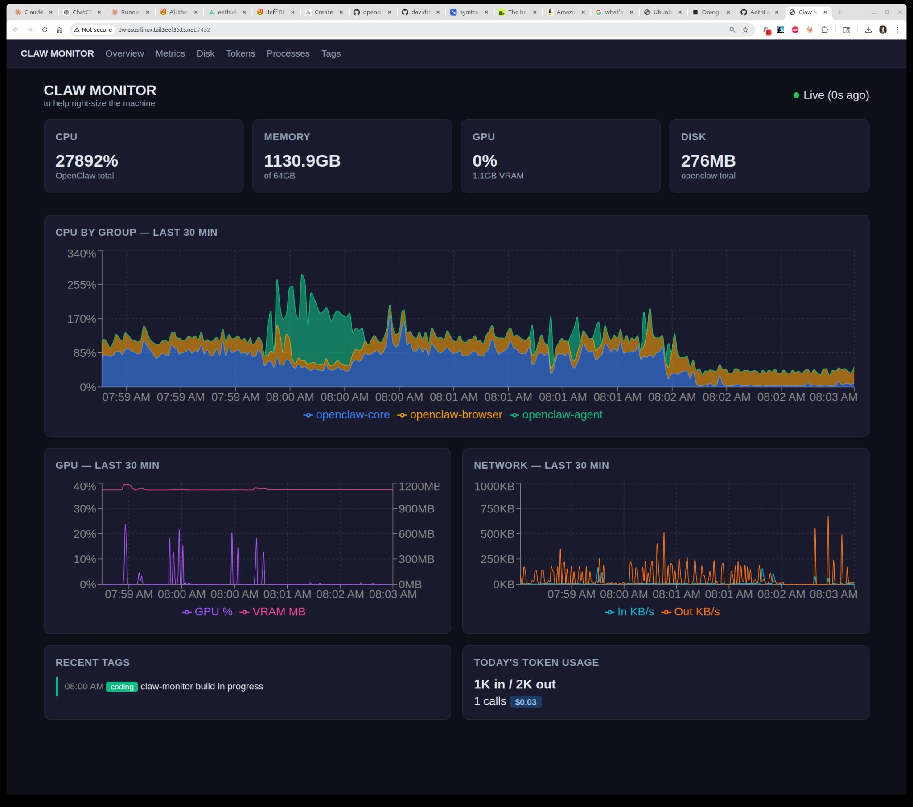

# claw-monitor — Project History

## Attribution Convention

Each entry notes who did what at a high level:
- **David** — product owner; defines requirements and approves design
- **DavidBot** — OpenClaw main session; orchestrator; writes/updates design docs; incorporates David's feedback
- **claw-monitor-builder** — OpenClaw subagent spawned by DavidBot; manages Claude Code; routes concerns upward
- **Claude Code** — implementation agent; performs architecture review; will write all code once approved

---

## 2026-03-06 — Project Kickoff

### Context
David Williams requested a lightweight OpenClaw resource monitor. The project was initiated via Signal message at 06:33 PST.

**Who did what:** David defined requirements. DavidBot wrote the initial README.md and HISTORY.md, spawned claw-monitor-builder, committed to repo.

### Requirements (as stated)
- Second-by-second (polling every 10s) monitoring of CPU, memory, and network I/O attributable to OpenClaw
- Token usage tracking for external LLM tool calls
- Dynamic process registration: OpenClaw fires a trivial one-shot API call when it starts using a new tool/agent/OS utility
- No LLM/AI involvement in the monitor itself
- Low-priority daemon (does not compete with Qwen or OpenClaw)
- Web dashboard: Next.js + React + Radix UI Themes + Recharts
- Permanent port, accessible from all Tailscale-linked devices
- Data stored in a database (SQLite chosen for simplicity)
- Design-first: **no code until David approves the plan**

### Participants
- **DavidBot** (OpenClaw main session) — orchestrator, author of initial README/HISTORY
- **claw-monitor-builder** — spawned subagent managing Claude Code planning session
- **Claude Code** — architecture reviewer (planning mode only until approval)

### Initial Design Decisions
- **Port:** 7432 (permanent, systemd-managed)
- **Collector language:** Python 3 + psutil (simplest for v1; Rust rewrite possible later)
- **Database:** SQLite (no infra overhead; better-sqlite3 in Next.js, sqlite3 in Python)
- **API:** REST (Next.js API routes) — simple, debuggable, easy for shell curl calls
- **Dashboard:** Next.js App Router + Radix UI Themes + Recharts
- **OpenClaw integration:** fire-and-forget `curl ... &` shell call, wrapped in `scripts/register-tool.sh`
- **Live updates:** SSE (Server-Sent Events) at ~10s refresh
- **Tailscale access:** `http://dw-asus-linux.tail3eef35.ts.net:7432`

---

## 2026-03-06 — Claude Code Architecture Review

**Who did what:** claw-monitor-builder directed the session. Claude Code performed the architecture review, identified the bugs below, and resolved all open questions. DavidBot incorporated results into README.md and HISTORY.md.

### Session Summary
Claude Code reviewed the initial architecture and provided detailed analysis, component specifications, and recommendations on all open questions.

### Architecture Issues Identified and Resolved

#### 1. PID Reuse (Critical Correctness Bug)
**Problem:** Linux recycles PIDs. Original schema used `pid INTEGER PRIMARY KEY` — if an OpenClaw process died and an unrelated process got the same PID, the collector would attribute the wrong process's resources to OpenClaw. Worse, the new registration would collide with the old DB row.

**Fix:**
- `process_registry` table now uses `id INTEGER PRIMARY KEY AUTOINCREMENT` (not `pid`)
- `pid` is a regular column with a non-unique index
- Collector verifies `/proc/<pid>/comm` matches the registered `name` before trusting a PID
- If comm mismatch detected → marks old row `unregistered`, ignores new (unrelated) process

#### 2. Per-PID Network I/O Not Feasible
**Problem:** Original design referenced `/proc/<pid>/net/dev` for per-PID network accounting. That file shows per-interface stats for the entire network namespace, not per-PID.

**Per-PID net requires:** Either netfilter/cgroups (heavy) or libpcap + /proc correlation (complex).

**Fix:** Network I/O collected machine-wide from `/proc/net/dev`. Stored in dedicated rows where `grp='machine'`. Per-group net columns removed from the schema. v2 candidate for per-PID net (cgroups or eBPF).

#### 3. CPU Percentage Needs Delta Calculation
**Problem:** `/proc/<pid>/stat` gives cumulative CPU ticks, not percentages. CPU% must be computed from delta between two readings: `(ticks_now - ticks_prev) / (elapsed_s * cpu_count)`.

**Implication:** The first sample after PID registration has no CPU data. `cpu_pct` is NULL for that row. Documented as expected behavior.

#### 4. SQLite WAL Mode Required for Concurrent Access
**Problem:** Python collector writes every 10s; Next.js API reads concurrently. Without WAL mode, this causes `SQLITE_BUSY` errors under load.

**Fix:** Both Python and Node.js must explicitly set `PRAGMA journal_mode=WAL` when opening the database. Added to schema.sql (applied on init) and documented in both component specs.

#### 5. Wrong API Path in File Layout
**Problem:** README showed `src/api/` but Next.js App Router puts API routes at `src/app/api/`.

**Fix:** Corrected to `src/app/api/` throughout.

#### 6. Token Events Lacked Session Correlation
**Problem:** No way to answer "how many tokens did session X consume?" — no `session_id` field.

**Fix:** Added `session_id TEXT` column to `token_events`. Optional field; matches OpenClaw session format (e.g., `agent:main:signal:direct:+15303386428`).

### Open Questions — Resolved

| Question | Decision | Rationale |
|---|---|---|
| Python vs Rust for collector? | **Python** | I/O-bound operation; psutil handles /proc robustly; <200 lines; Rust saves nothing measurable |
| Token cost storage? | **Raw counts only** | Pricing changes frequently (3x in 18 months); compute USD in dashboard via `pricing.json`; drop `cost_usd` column from schema |
| Data retention? | **14 days full-res, daily aggregates forever** | ~35 MB for 14 days (10s/6 groups/50 bytes); daily sufficient for historical trends older than 1 month; changed from 7 days to 14 days |
| Auth on port 7432? | **Tailscale + IP range middleware** | Tailscale = network auth; add 5-line middleware rejecting requests outside 100.64.0.0/10 and 127.0.0.1 as defense-in-depth |
| PM2 vs systemd? | **systemd (user scope)** | Collector already uses systemd; consistent tooling; no extra deps; native log rotation; `systemctl --user status claw-*` shows both |
| WebSocket vs SSE? | **SSE** | Unidirectional push; native to Next.js; `EventSource` auto-reconnects; 10s interval means no latency need for WebSocket |

### Schema Changes (vs. initial design)

1. `process_registry`: PK changed from `pid` to autoincrement `id`; `pid` becomes regular indexed column
2. `token_events`: `cost_usd` column dropped; `model` made `NOT NULL`; `session_id TEXT` column added
3. New `metrics_daily` table added for long-term aggregates
4. `metrics` table: network columns (`net_in_kb`, `net_out_kb`) only populated on rows where `grp='machine'`; removed from per-group rows

### New Content Added to README

- Detailed collector core loop (pseudocode)
- PID auto-grouping rules table
- Known limitations section
- Full API specification with request/response schemas for all 6 endpoints
- Complete file layout with per-file descriptions
- OpenClaw integration protocol (exact curl commands, timing, format)
- Failure mode table
- Dashboard wireframes (ASCII) for all 4 pages
- Step-by-step deployment instructions
- systemd unit structure notes
- Day-to-day operations commands

### Status After Planning Session
- [x] Repo created by David
- [x] README.md written (initial architecture)
- [x] HISTORY.md started
- [x] Claude Code architecture review complete
- [x] All open questions resolved with recommendations
- [x] README.md expanded with full design detail
- [x] HISTORY.md updated with all decisions
- [ ] **David reviews and approves plan** ← current step
- [ ] Implementation begins
- [ ] Testing
- [ ] Deployment

---

## 2026-03-06 — Adaptive Polling Requirement Added

**Who did what:** David raised the requirement. DavidBot designed the self-detecting approach and documented it in README. No Claude Code involvement.

### Context
David raised a new requirement at 06:47 PST (before implementation started): rather than a fixed 10s poll interval, the collector should use an **adaptive interval** that slows during idle periods and speeds up during active ones. Goal: avoid an "absolute mountain of data" while keeping granularity where it matters.

### Design Discussion

**Signaling mechanism options considered:**
1. **Self-detecting** (chosen) — collector observes openclaw-gateway CPU% from the previous sample to decide the next interval. Zero coupling, zero overhead on OpenClaw, no new API endpoints.
2. Activity endpoint — OpenClaw POSTs `/api/activity` level. Rejected: adds coupling and still needs a CPU proxy anyway.
3. File-based heartbeat — OpenClaw touches a file; collector checks mtime. Rejected: fragile, same coupling issue.

### Decision: Self-Detecting Adaptive Intervals

| Gateway CPU% (prev sample) | Consecutive idle samples | Next interval |
|---|---|---|
| > 40% | any | **5s** (heavy activity) |
| 15–40% | any | **10s** (active) |
| 2–15% | any | **30s** (light / heartbeat) |
| < 2% | 1–2 | **30s** (transitioning to idle) |
| < 2% | 3+ | **60s** (deep idle) |

### Data Sparsity Handling

Sparse/irregular intervals require time-scale x-axis in charts (not sequential index). Recharts handles this via `XAxis dataKey="ts" type="number" scale="time"`. Idle gaps display as honest time gaps in charts.

**Schema addition:** `sample_interval_s INTEGER` column added to `metrics` table. Records actual elapsed seconds per sample. Enables "data density" indicator in dashboard UI.

### HISTORY.md Confirmation
David asked: "Just to confirm you are putting the history of this design process and of the future implementation process into history.MD right?"

**Yes.** Every design decision, every architecture change, every significant conversation goes into `HISTORY.md`. This is the living record of how the project got where it is. Implementation decisions and debugging notes will be added as the project proceeds.

### README Changes
- Description updated to reference adaptive polling
- Goal 3 updated ("adaptive poll interval, 5s–60s")
- Architecture overview updated
- Collector component spec replaced with full adaptive polling spec:
  - Interval table (CPU% thresholds → target intervals)
  - Data sparsity implications
  - `sample_interval_s` schema addition
  - Updated core loop pseudocode (now includes adaptive interval logic)
- Known Limitations updated (PID churn window now "5–60s" not "10s")

---

## 2026-03-06 — David's Design Review Round 2 (07:14 PST)

**Who did what:** David reviewed the plan and raised 7 new requirements. DavidBot incorporated all of them into a full README rewrite and updated HISTORY. No Claude Code involvement in this round.

### Requirements Added / Clarified

#### 1. Agent Collaboration Documentation
**Requirement:** Document how DavidBot, claw-monitor-builder, and Claude Code are working together. HISTORY.md should attribute who did what at a high level.

**Done:** Added "Agent Collaboration" section to README with role table and decision authority description. Added "Attribution Convention" block to the top of HISTORY.md. Prior entries updated with "Who did what" callouts.

#### 2. OpenClaw Integration: Minimal Coupling + Remembering Problem
**Requirement:** Clarify that the integration should not be onerous or influence token consumption. OpenClaw should tell the tool the *kind* of thing it's doing and let the tool infer attribution from /proc. Address the problem of forgetting to report.

**Design response:**
- Renamed concept to "Minimal Coupling" principle: collector autodiscovers all PIDs from /proc; OpenClaw does NOT need to report individual processes for resource attribution.
- OpenClaw provides only two things: **tags** (work type) and **token counts** (invisible to OS).
- Detailed "Remembering Problem" table added to README showing reliability by trigger type: HIGH for session start and agent spawn, MEDIUM for mid-session type changes, LOW for session end.
- Mitigation: tags are "until next tag" semantics — a missed update extends the previous tag slightly, not a data loss.
- Two lines to be added to AGENTS.md startup routine to remind DavidBot to tag at conversation start.

#### 3. File System Monitoring
**Requirement:** Include disk/storage stats — how much space OpenClaw is taking up including log files. Exclude the monitor itself.

**Design response:**
- New `disk_snapshots` table added to schema.
- New `/api/disk` endpoint.
- New `disk_tracker.py` module using os.walk().
- New `/disk` dashboard page with stacked bar chart by directory.
- Tracked: `~/.openclaw/workspace`, `~/.openclaw/sessions`, `~/.openclaw/media`, `~/.openclaw/logs`, `~/.openclaw/claw-monitor`, `~/.openclaw` (total). journald log size via `journalctl --disk-usage`.
- **Excluded:** `~/work/claw-monitor/` (the tool itself).
- Written every 60s regardless of activity (disk growth is always relevant).

#### 4. Adaptive Collection: 1s Sweep, Write-Gated
**Requirement:** The 1s sweep can always run. Just don't write to DB every second when idle. This reduces risk of missing short activity bursts.

**Design response:**
- Replaced the "adaptive interval" model with a "sweep vs write" separation:
  - **Fast loop always runs at 1s** (reads CPU, mem, net, GPU into memory)
  - **Write gate:** write to DB if any OpenClaw PID has CPU% > 2% (activity) OR if last write was ≥60s ago (idle heartbeat)
  - **Idle heartbeat:** writes one row per 60s with `is_idle_heartbeat=1` — marks "still idle, nothing happened" so gaps are distinguishable from missing data
- Disk stats: 60s slow loop, separate from fast loop (os.walk is expensive)
- Added `is_idle_heartbeat INTEGER DEFAULT 0` column to metrics schema.
- `sample_interval_s` now reflects actual elapsed time since last write, not a target.

#### 5. GPU Monitoring
**Requirement:** Include GPU use in v1 (David expected this would be v2 but now wants it from the start).

**Design response:**
- Added GPU monitoring via `pynvml` (Python: `pip install nvidia-ml-py3`).
- Metrics: GPU utilization %, VRAM used (MB) vs 24576 MB total, power draw (watts).
- New `gpu_tracker.py` module.
- Stored as `grp='gpu'` rows in `metrics` table (machine-level; per-process GPU not feasible without NVIDIA MIG/cgroups).
- New `GpuChart.tsx` dashboard component.
- GPU data added to daily aggregates table.
- Added to /api/metrics/stream SSE payload.
- `nvidia-ml-py3` added to deployment prerequisites.

#### 6. Tagging System
**Requirement:** Allow OpenClaw, David, or anything to tag the timeline with what they're doing — category (type of work) and a text description. These tags should overlay on charts to help interpret resource logs. DavidBot must remember to use them.

**Design response:**
- New `tags` table in schema (id, ts, category, text, source, session_id).
- Categories: `conversation`, `coding`, `research`, `agent`, `heartbeat`, `qwen`, `idle`, `other`.
- New `POST /api/tags` and `GET /api/tags` endpoints.
- New `scripts/tag.sh` helper: `tag.sh <category> <text>` — validates, fires curl in background, exits 0 always.
- New `TagOverlay.tsx` + `TagLog.tsx` components.
- New `/tags` dashboard page with full tag history and manual tag creation UI.
- Tag bands + vertical lines overlaid on all time-series charts.
- **Remembering:** Addressed in README "Remembering Problem" section. DavidBot will add two lines to AGENTS.md: tag at session start and before agent spawns. This is reliable. Mid-session updates are best-effort. The design tolerates missed updates gracefully.

#### 7. Motivation Section
**Requirement:** Near the top of README, motivate why this tool exists — to help decide machine sizing (CPU speed, RAM, disk) for people's use.

**Done:** Added "Motivation" section as the first content section in README, above Goals. States the infrastructure sizing purpose clearly, including the secondary goal of understanding resource composition (gateway vs Chrome vs agents vs Qwen vs system).

### Major README Changes (Round 2)
- **New sections:** Motivation, Agent Collaboration, Tagging System, `/disk` API, `/tags` API, `/disk` and `/tags` dashboard pages
- **Revised sections:** OpenClaw Integration (renamed to "Minimal Coupling" principle), Collector (now two-loop architecture), Schema (added disk_snapshots, tags tables; updated metrics for GPU and idle heartbeat flag), File Layout (added new files), Design Decisions table (expanded to 10 decisions)
- **README was substantially rewritten** to integrate all 7 requirements coherently; previous version preserved in git history

### Status After Round 2
- [x] Repo created by David
- [x] Initial design (DavidBot + Claude Code planning session)
- [x] Adaptive polling (DavidBot)
- [x] Round 2 design review (DavidBot, this entry)
- [ ] **David reviews Round 2 plan** ← current step
- [ ] Implementation begins (Claude Code, directed by claw-monitor-builder)
- [ ] Testing
- [ ] Deployment

---

## 2026-03-06 — Adaptive Write Clarification (07:32 PST)

**Who did what:** David clarified intent. DavidBot redesigned the write gate and updated README and HISTORY. No Claude Code involvement.

### Clarification
The previous design (Round 2) still wrote an idle heartbeat row to `metrics` every 60s regardless of activity. David's intent: during 8+ hours of overnight inactivity, produce zero rows — no CPU cost from writing, no disk cost from storing zeros.

### Design Change: Strictly Activity-Gated Writes

**Old behaviour:** Write to `metrics` if activity detected OR if last write was ≥60s (idle heartbeat).
**New behaviour:** Write to `metrics` ONLY if any OpenClaw PID CPU% > 1%. Zero rows during idle. Full stop.

**Problem this creates:** Without idle heartbeat rows, the dashboard can't distinguish "nothing happened" from "the collector crashed."

**Solution:** `collector_status` — a single-row table (not an append log). The slow loop (60s) updates `last_seen` in this one row. The fast loop sets `started_at` on startup. The table never grows. Cost: one UPDATE every 60s (trivial).

Dashboard gap interpretation:
- Gap + `last_seen` falls within gap period → **grey: intentional idle**
- Gap + `last_seen` predates gap → **amber warning: collector was down**

### Schema Changes
- Removed `is_idle_heartbeat INTEGER DEFAULT 0` from `metrics` table
- Added `collector_status` table (single row, enforced by `CHECK (id = 1)`)
- `metrics` comment updated: "written ONLY when OpenClaw activity detected"

### SSE Changes
- SSE stream no longer emits events during idle (connection stays open, no data frames)
- Added `ping:` keep-alive frame every 30s to prevent proxy timeouts
- `[Live ●]` stays green during idle; goes red only on connection loss

### Activity Threshold
- 1% CPU as the write trigger (configurable in `config.py`)
- Rationale: low enough to catch brief heartbeat spikes; high enough to skip true background noise

### Status
- [x] Round 2 design complete
- [x] Write gate refined (this entry)
- [x] David approved — implementation begins 07:37 PST 2026-03-06

---

## 2026-03-06 — Full Implementation (07:45–08:00 PST)

**Who did what:** David triggered implementation. Claude Code built all phases. claw-monitor-builder managed the session.

### Implementation Summary

All 6 phases completed in a single session:

| Phase | What | Result |
|---|---|---|
| 1 | schema.sql + DB init | 7 tables, WAL mode, at ~/.openclaw/claw-monitor/metrics.db |
| 2 | claw-collector/ Python daemon | 7 modules: collector.py, db.py, pid_tracker.py, net_tracker.py, gpu_tracker.py, disk_tracker.py, config.py |
| 3 | scripts/tag.sh + register-tool.sh | Fire-and-forget shell helpers, always exit 0 |
| 4 | web/ Next.js app | 8 API routes, 11 components, 6 pages, SSE streaming, Tailscale IP guard |
| 5 | systemd units | claw-collector.service + claw-web.service installed |
| 6 | Build + deploy | npm install, npm run build, both services active |

### Build Issues Resolved

1. **next.config.ts not supported** — Next.js 14 requires .mjs, not .ts
2. **ES5 target + Set iteration** — Changed tsconfig target to es2017
3. **Token summary type inference** — Refactored to avoid spread + Record type clash
4. **Static API route caching** — Added `export const dynamic = "force-dynamic"` to registry route

### Verification

- Collector found gateway PID 35324, auto-registered 58+ processes
- Metrics flowing: CPU, memory, net, GPU data writing to DB
- All API endpoints verified: tags, tokens, registry, metrics, disk
- Both systemd services active (running)
- Dashboard accessible at http://dw-asus-linux.tail3eef35.ts.net:7432

### Status
- [x] Phase 1: Schema + DB
- [x] Phase 2: Collector
- [x] Phase 3: Scripts
- [x] Phase 4: Web app
- [x] Phase 5: systemd units
- [x] Phase 6: Build + deploy
- [x] Full stack running

---

## 2026-03-06 — First Run: Overview Page Screenshot (08:05 PST)

**Who did what:** David opened the dashboard and sent a screenshot. DavidBot archived it and noted initial observations.

Screenshot saved: `docs/screenshot-overview-first-run-2026-03-06.png`



### What the screenshot shows
- Dark-themed dashboard, nav: Overview / Metrics / Disk / Tokens / Processes / Tags
- Tagline "to help right-size the machine" visible under the title ✅
- Live indicator: **● Live (0s ago)** ✅
- CPU by Group chart (07:59–08:03 AM) showing heavy activity during the build — openclaw-core (blue), openclaw-browser (orange), openclaw-agent (green). The agent spike (green) correlates with Claude Code running during phases 1–4.
- GPU: ~40% utilization flat line (VRAM 1.1GB) — likely the idle GPU baseline
- Network: bursty outbound traffic during the build
- Recent Tags: `coding — claw-monitor build in progress` ✅ (tag.sh worked)
- Today's Token Usage: 1K in / 2K out, $0.03 ✅

### Obvious display bugs to fix
1. **CPU showing 27892%** — summing raw CPU% across all processes/cores without normalizing by CPU count. Should cap at 100% × number of tracked groups, or normalize per-core.
2. **Memory showing 1130.9GB of 64GB** — almost certainly summing virtual memory (VSZ) instead of RSS. Should use VmRSS from `/proc/<pid>/status`.

These are collector or display calculation bugs, not data collection bugs. Data is flowing correctly. Fixing in the next round.

---

## 2026-03-06 — First-Run Bug Fixes (08:07 PST)

**Who did what:** David spotted the bugs from the first-run screenshot. DavidBot diagnosed and fixed them directly (no Claude Code involvement — targeted frontend fix).

### Bug 1: CPU stat card showing ~27,892%

**Root cause:** `page.tsx` was accumulating `latestCpu` across every row in the 30-minute window (up to 1800 rows × N groups). A single row with cpu_pct=50 across 600 active rows = 30,000%.

**Fix:** Compute summary stats from only the most recent timestamp's rows (`latestTs`). Changed display from "%" to "cores" (cpu_pct_sum / 100), which is cleaner for a sizing tool — "OpenClaw is using 2.4 cores right now" is more actionable than a % that can legitimately exceed 100% on multi-threaded workloads.

### Bug 2: Memory showing ~1,130 GB

**Root cause:** Same accumulation bug. Memory was summed across all 1800 rows, then divided by 1024 to "convert to GB". 600 rows × 2,000 MB each = 1,200,000 MB ÷ 1024 = ~1,172 GB.

The collector was reading VmRSS correctly — the data in the DB was always right.

**Fix:** Same pattern — only sum `mem_rss_mb` from rows at `latestTs`. Label updated to "RSS (now)" for clarity.

### Files changed
- `web/src/app/page.tsx` — fixed accumulation logic, changed CPU display to "cores", updated labels
- `web/` rebuilt and `claw-web.service` restarted

---

## 2026-03-06 — Tag Backdating (08:16 PST)

**Who did what:** David requested the feature. DavidBot implemented it directly (API route + script, no Claude Code involvement).

### Feature: `ts` field on POST /api/tags

Tags can now be backdated via an optional `ts` field. Formats accepted:
- Omitted → now
- Unix timestamp (number)
- `"-10m"` / `"-30s"` / `"-2h"` — relative delta
- `"10 minutes ago"` — natural language relative
- `"2026-03-06T08:03:00"` — ISO-8601 absolute

The `resolveTs()` helper in `route.ts` handles all parsing. Returns HTTP 400 with a clear error message if the format is unrecognisable.

`tag.sh` updated: optional 5th argument is the `ts` value (passed as JSON string to the API).

All four formats smoke-tested and confirmed working.

### Files changed
- `web/src/app/api/tags/route.ts` — added `resolveTs()`, parse `ts` from body
- `scripts/tag.sh` — added optional 5th `[ts]` arg, uses `python3 -c json.dumps` for safe JSON encoding of text and ts values

---

## 2026-03-06 — Tag `recorded_at` field + backdated indicator (08:22 PST)

**Who did what:** David asked for confirmation and the indicator feature. DavidBot confirmed behaviour, implemented `recorded_at`, and added the UI indicator. No Claude Code involvement.

### Confirmation
The effective `ts` stored in the DB **is** the adjusted/backdated time — not the wall-clock submission time. Verified with live DB query: a tag posted with `ts="-15m"` is stored at 08:28, while the service received it at 08:43.

### Changes

**Schema:** Added `recorded_at INTEGER NOT NULL` to `tags` table.
- `ts` = effective timestamp (the one shown on charts; may be backdated)
- `recorded_at` = wall-clock time the POST was received (always now)
- `ts != recorded_at` (by >5s) → tag is considered backdated
- Existing rows backfilled: `recorded_at = ts` (original submission time unknown)

**API (`/api/tags`):**
- POST: always sets `recorded_at = Date.now()` server-side; `ts` = `resolveTs(rawTs)`
- GET: now returns `recorded_at` in every tag row
- Source validation updated to accept `clawbot`/`user` (new names) plus `openclaw`/`david` (legacy backcompat)

**UI (`TagLog.tsx`):**
- Backdated tags show a small superscript `↩` next to the timestamp
- Tooltip on hover shows the original submission time (`recorded_at`)
- Chart overlays (`TagOverlay.tsx`) unchanged — tags appear at `ts` with no extra annotation there

---

## 2026-03-06 — GitHub Fine-Grained PAT for claw-monitor (09:26 PST)

**Who did what:** David provided a new fine-grained PAT scoped to the claw-monitor repo only. DavidBot configured the remote.

- Remote switched from SSH (`git@github.com:...`) to HTTPS with token embedded in URL
- Token stored at `~/.openclaw/claw-monitor-github-token`
- Token is NOT added to `~/.git-credentials` (would grant general github.com access) — lives only in the remote URL, same pattern as openclaw-workspace
- Repo confirmed clean and up to date with origin before starting test work

---

## 2026-03-06 — Test Planning Task Initiated (09:34 PST)

**Who did what:** David requested the test plan. DavidBot authored the task brief and spawned claw-monitor-builder. Claude Code will do the reading and writing.

### Motivation
The codebase was implemented largely by Claude Code under light supervision. There is currently no test coverage. Before any further feature work, David wants a thorough test plan that can be handed to a developer (human or AI) for implementation.

### Requirements
- Unit tests and functional tests
- Emphasise **coverage** — name every test case, what it asserts, what it mocks
- Functional tests must exercise **real data collection behaviour** from the running system — not just mocked logic
- **No implementation yet** — plan only

### Scope
1. Python unit tests — all collector modules (pid_tracker, net_tracker, gpu_tracker, disk_tracker, db, collector fast/slow loop)
2. Next.js API unit tests — all 8 routes + middleware IP guard + resolveTs() backdating all 5 formats
3. Functional / integration tests — write-gate behaviour, collector_status liveness, SSE stream, end-to-end tag.sh → DB → API roundtrip
4. Test infrastructure — framework choices, SQLite isolation, /proc mock strategy, GPU/CI handling, coverage targets

### Participants
- **DavidBot** — orchestrator; authored task brief; owns HISTORY update
- **claw-monitor-builder** — subagent managing Claude Code planning session
- **Claude Code** — reads all source files; produces TEST_PLAN.md

### Output
`~/work/claw-monitor/TEST_PLAN.md` — pending completion

---

## 2026-03-06 — Test Plan Review + Port Placeholder + Multi-Instance Support (09:50 PST)

**Who did what:** DavidBot reviewed TEST_PLAN.md, spotted gaps. David reviewed and added requirements. DavidBot authored task brief and re-spawned claw-monitor-builder to address them.

### Issues to Address in TEST_PLAN.md
1. `cost.ts` has no standalone test section — add `cost.test.ts` explicitly
2. SSE tests assume DB polling in the route — flag this assumption; plan should note it needs verification
3. Slow-loop 60s wait tests need a `time.sleep` mock strategy for fast unit test alternatives
4. Full test suite review for any other areas of concern

### New Requirement: Multi-Instance / Test Isolation
Tests will run **alongside a live running instance** of claw-monitor. This means:
- Every configurable resource must be parameterisable: DB path, port, collector config
- No test should hardcode the default DB path (`~/.openclaw/claw-monitor/metrics.db`) or port (7432)
- Each test run gets its own temp SQLite DB
- Web app must be startable on an alternate port for integration tests
- Collector must be pointable at an alternate DB path
- TEST_PLAN.md must reflect this throughout — test infrastructure section needs a full isolation strategy

### New Requirement: Port Placeholder in Docs
Port `7432` is hardcoded throughout README.md, INSTRUCTIONS.md, and possibly other docs. This is fragile.
- Introduce placeholder **`CM_PORT`** (short, unambiguous) to replace all hardcoded `7432` references in docs
- At the top of each affected file, add a short explanation: what `CM_PORT` means and where the actual value is configured
- Code/config files (next.config.mjs, systemd units, scripts) should use an environment variable `CM_PORT` with `7432` as the default
- TEST_PLAN.md: all test port references use `CM_PORT` or the test-instance env var pattern

### Participants
- **DavidBot** — orchestrator; HISTORY author
- **claw-monitor-builder** — subagent directing Claude Code
- **Claude Code** — edits TEST_PLAN.md and all affected docs

### Output
- Updated `TEST_PLAN.md`
- Updated `README.md` (port placeholder + explanation)
- Updated `INSTRUCTIONS.md` (port placeholder + explanation)
- Any other doc files with hardcoded 7432

---

## 2026-03-06 — Test Plan Round 3: Gap Fixes + Running Tests Section (10:07 PST)

**Who did what:** DavidBot reviewed TEST_PLAN.md in full and identified gaps. David confirmed and added a requirement. DavidBot authored task brief and spawned claw-monitor-builder.

### Gaps Identified by DavidBot

1. **No monitoring overhead tests** — the collector's own CPU/RAM footprint is never measured. Core to the project's mission; must be added.
2. **No non-OpenClaw isolation tests** — nothing verifies that processes outside the gateway tree produce zero rows and don't open the write-gate.
3. **`sample_interval_s` correctness untested** — the column exists but the elapsed-time math is never verified.
4. **Idle→active→idle transitions untested** — write-gate tests only cover steady states.
5. **`metrics_daily` day-boundary logic untested** — rollup timing at midnight not covered.
6. **Missing `DISK_DIRS` at slow-loop level untested** — only the function-level is tested, not the loop's handling of non-existent configured dirs.

### New Requirement: "Running the Tests" Section

Add a section at the **top** of TEST_PLAN.md (after the intro, before section 1) covering:
- How to run all tests (unit, integration, full suite)
- How to interpret results (pass/fail/skip, coverage report, expected flakes)
- How to fix failures: a structured workflow —
  1. Run tests, get failure list
  2. Present failures to user and ask which to fix
  3. Generate a fix plan for approved failures
  4. Fix bugs only when user approves the plan

### Participants
- **DavidBot** — orchestrator; HISTORY author
- **claw-monitor-builder** — subagent directing Claude Code
- **Claude Code** — edits TEST_PLAN.md

### Output
Updated `~/work/claw-monitor/TEST_PLAN.md`, committed and pushed.

---

## 2026-03-06 — Test Implementation Begins (10:25 PST)

**Who did what:** David approved implementation. DavidBot added §0.5 iterative workflow to TEST_PLAN.md and spawned claw-monitor-builder to direct Claude Code through the full implementation.

### Approach
Tests implemented one file/group at a time. For each group: implement → run → fix test if wrong → report code bugs to user for approval → fix code → commit → next group. David wants regular progress updates throughout.

### Implementation Order
1. `test_db.py` (foundation)
2. `test_pid_tracker.py`
3. `test_net_tracker.py`
4. `test_gpu_tracker.py`
5. `test_disk_tracker.py`
6. `test_collector.py` (CpuTracker, sync_processes, write-gate, overhead, isolation)
7. Next.js: `middleware.test.ts` + `cost.test.ts`
8. Next.js: `tags.test.ts`
9. Next.js: remaining API routes
10. Integration tests

### Status
- [ ] test_db.py
- [ ] test_pid_tracker.py
- [ ] test_net_tracker.py
- [ ] test_gpu_tracker.py
- [ ] test_disk_tracker.py
- [ ] test_collector.py
- [ ] middleware + cost (Next.js)
- [ ] tags (Next.js)
- [ ] remaining API routes (Next.js)
- [ ] Integration tests

---

## 2026-03-06 — Integration Test Rework: Real HTTP Server (10:52 PST)

**Who did what:** David reviewed integration test approach. DavidBot diagnosed the gap — tests were hitting DB directly, not via HTTP. Spawned claw-monitor-builder to fix.

### Problem
Integration tests were largely bypassing the actual HTTP API and manipulating SQLite directly. Not a real integration test — a code bug in an API route would go undetected. Also, `run-tests.sh --integration` was starting services externally rather than having the test suite manage its own lifecycle.

### Requirements
- Integration tests must be fully self-contained — start their own web server + collector, make real HTTP requests, tear down cleanly
- Must run safely alongside the production instance (different DB path, random port)
- No manual service management required — `./run-tests.sh --integration` does everything

---

## 2026-03-06 — Overview Page Redesign Implementation (12:02 PST)

**Who did what:** David approved spec and said go. DavidBot spawning claw-monitor-builder to direct Claude Code.

### Spec reference
`docs/UI_SPEC.md` — Overview page. Key changes:
- Add Tokens stat card (current tok/min, last 60s)
- Replace separate CPU/GPU/Network mini-charts with a single combined chart
- Left Y-axis: CPU (cores) + Memory (GB). Right Y-axis: GPU (%) + Network (KB/s) + Tokens (tok/min)
- Token line: smoothed (Recharts monotone + rolling average)
- Tag markers on time axis: colour-coded by category, hover popup, 8px clustering
- Time range picker (same as Metrics page), persisted in localStorage
- Hover crosshair tooltip showing all resource values

### Participants
- **DavidBot** — orchestrator; HISTORY author
- **claw-monitor-builder** — subagent directing Claude Code
- **Claude Code** — implements web/src/app/page.tsx and supporting components

---

## 2026-03-06 — Bug: register-tool.sh missing `tokens` sub-command (12:26 PST)

**Diagnosis:** Token rate always shows 0. DB has only 1 token event (the integration test entry). Root cause: `register-tool.sh` has no `tokens` sub-command. INSTRUCTIONS.md describes `register-tool.sh tokens <tool> <model> <in> <out>` but the script interprets "tokens" as a PID and silently fails. Nothing ever reaches /api/tokens.

**Fix approach (TDD):**
1. Write failing test that exercises the full token pathway: `register-tool.sh tokens` → POST /api/tokens → DB row → /api/tokens/rate returns non-zero
2. Run test, confirm it fails
3. Add `tokens` sub-command to `register-tool.sh`
4. Run test again, confirm it passes
5. Update TEST_PLAN.md §0.4 to mandate this TDD approach for all future bug fixes

---

## 2026-03-06 — claw-proxy Implementation (13:08 PST)

**Who did what:** David approved. DavidBot spawning claw-monitor-builder to implement per PROXY_PLAN.md.

### Scope
- Phase 1: All three proxies (Anthropic, OpenAI, Llama) + full test suite
- Phase 2: Manual curl verification against all three
- Phase 3+4: Anthropic live switchover — SEPARATE SESSION, David present

### Participants
- **DavidBot** — orchestrator; HISTORY author
- **claw-monitor-builder** — subagent directing Claude Code
- **Claude Code** — implements claw-proxy/ directory

---

## 2026-03-06 — End of Day Summary (14:06 PST)

### What was completed today

| Item | Status |
|------|--------|
| GitHub fine-grained PAT for claw-monitor repo | ✅ Done |
| TEST_PLAN.md — full test plan (3 rounds of review) | ✅ Done |
| All tests implemented (11 groups, ~173 tests) | ✅ Done |
| Integration tests reworked — real HTTP server, fully self-contained | ✅ Done |
| `run-tests.sh` one-liner (unit + integration) | ✅ Done |
| `CM_PORT` placeholder throughout docs | ✅ Done |
| Bug fix: `register-tool.sh tokens` sub-command missing (TDD) | ✅ Done |
| TEST_PLAN.md §0.4 — TDD-first mandate for bug fixes | ✅ Done |
| Overview page redesign (spec + implementation) | ✅ Done |
| `docs/UI_SPEC.md` — Overview page spec | ✅ Done |
| `docs/PROXY_PLAN.md` — claw-proxy plan (3 providers) | ✅ Done |
| claw-proxy implementation — Anthropic, OpenAI, Llama | ✅ Done |
| All 52 proxy tests passing | ✅ Done |
| Systemd units installed (not started) | ✅ Done |

### Stopping point — What's next

**Next session priority: Phase 3 & 4 — Live Anthropic proxy switchover**
This must be done with David present and watching Signal.
Full procedure in `docs/PROXY_PLAN.md`.

Steps:
1. Verify `source ~/.bashrc` loads `ANTHROPIC_API_KEY`
2. Start proxy: `systemctl --user start claw-proxy-anthropic`
3. Manual curl test through proxy → verify token event in DB
4. Arm 2-minute dead man's switch (shell bg job)
5. Apply one-line config change in OpenClaw (`anthropic.baseUrl = http://localhost:14000`)
6. Restart OpenClaw gateway
7. David sends a test message — verify response + tok/min appears in dashboard
8. Cancel dead man's switch
9. Enable proxy service for auto-start: `systemctl --user enable claw-proxy-anthropic`

**After that:**
- Wire up OpenAI proxy (same process, shorter since Anthropic already proven)
- Wire up Llama proxy (only when Qwen server is running)
- UI work: remaining pages (Metrics, Disk, Tokens, Processes all need review/redesign)
- Consider: tag overlay on Metrics page (same as Overview)
- Consider: Tokens page — show cost breakdown, historical graph

---

*Future entries appended below as the project progresses.*

---

## 2026-03-07 — Metrics page: Disk, Tokens, Tags panels

**Who did what:** David approved panel order; DavidBot updated UI_SPEC.md and README; Claude Code implementing.

### Change
Adding three missing panels to `/metrics` (Time-Series Explorer):

1. **Disk** — `openclaw-total` MB over time from `disk_snapshots`, line chart
2. **Tokens/min** — bucketed rate from `token_events`, smoothed line (reuses Overview logic)
3. **Tags** — dedicated horizontal timeline panel at the bottom; colored markers by category, hover tooltips, 8px clustering

Panel order: CPU → Memory → GPU → Network → Disk → Tokens/min → Tags

Docs updated: `docs/UI_SPEC.md` (full Metrics page spec added), `README.md` (`/metrics` description updated).

Implementation completed by Claude Code (~2m 16s). TypeScript and build clean. Service restarted.

---

## 2026-03-07 — Network stat box added

**Who did what:** David requested; DavidBot implemented directly.

### Change
Added a **NETWORK** stat box to the top row of summary cards on the Overview page (`web/src/app/page.tsx`), sitting between Disk and Tokens.

- **Main value:** total throughput in kB/s, auto-upgrades to MB/s when ≥ 1024
- **Sub-label:** `↓ Xk ↑ Xk` — in/out split in the same smart unit
- Data source: existing `grp="net"` rows (`net_in_kb`, `net_out_kb`), divided by `sample_interval_s` for a proper rate
- Also added `sample_interval_s` to the `MetricRow` TypeScript interface (it was already returned by the API, just not typed)
- TypeScript compile: clean (`tsc --noEmit` no errors)

---

## 2026-03-07 — Tags panel hover tooltip fix

**Who did what:** David reported bug; DavidBot fixed directly.

### Change
The Tags timeline had `title={...}` on a 2px-wide div — effectively impossible to hover and using the browser's ugly default tooltip.

Fix:
- Wrapped each tick in a 12px invisible hover target (centered on the tick) so it's actually clickable
- Added a styled React tooltip (mouseEnter/Leave) showing: **category** (in tag color), **time** (HH:MM), **tag text**
- Visual 2px colored line unchanged
- TypeScript clean, build passed, claw-web restarted

---

## 2026-03-07 — Metrics page CPU/Memory unit fixes

**Who did what:** David reported incorrect units; DavidBot fixed directly.

### Change
Two display bugs on the Metrics `/metrics` page:

1. **CPU panel** was showing raw `cpu_pct` with `unit="%"`. Changed to divide by 100 at data-build time → shows **cores** (matches Overview page). 2 decimal places.
2. **Memory panel** was reusing `CpuAreaChart` with `unit="%"` but values were in MB → appeared as "thousands of percent". Changed to divide by 1024 → shows **GB**. 2 decimal places.

Also added `unit` and `decimals` props to `CpuAreaChart` component so both Y-axis tick labels and tooltip values reflect the correct unit.

TypeScript clean, build passed, claw-web restarted.

---

## 2026-03-08 — Chart domain fix (ongoing)

**Who did what:** David reported; DavidBot investigated and fixed (in progress).

### Problem
The Combined Chart's x-axis was not aligned to the current time. Three iterations:

**Attempt 1 (b49cfcd):** Changed `domain={["auto","auto"]}` → `domain={[(dataMin) => dataMin, () => Math.floor(Date.now() / 1000)]}`. Fixed the right edge but left edge was `dataMin` (wherever data actually started), not `now - rangeSeconds`. Also: `Date.now()` inside the domain function is called on every render, causing the domain to shift subtly each render cycle, triggering Recharts animation — data appeared to slide left.

**Attempt 2 (8035665):** Changed left bound to `() => Math.floor(Date.now() / 1000) - rangeSeconds`. Correct intent, but same problem: both bounds are functions calling `Date.now()` on every render. Made the animation artifact worse — data started on the right and animated left.

**Correct fix (planned, not yet committed):** Pass `from` and `to` as stable state values from `page.tsx` down to `CombinedChart`. Set them once per `fetchData` call, atomically with the data. Use static numbers as domain `[from, to]` — Recharts only triggers animation when values actually change. Also: disable `isAnimationActive` on all Lines/Areas — live monitoring charts should never animate.

---

## 2026-03-08 — Chart x-axis right-edge fix

**Who did what:** David reported; DavidBot fixed.

### Change

The Combined Chart on the Overview page had `domain={["auto", "auto"]}` on the Recharts XAxis. Recharts' `"auto"` snaps the axis bounds to "nice" rounded intervals, causing the right edge to extend to a future rounded time rather than the actual current time — leaving a gap and making the chart feel stale.

**Fix:** Pin the right domain bound to the actual current timestamp:
```js
domain={[(dataMin: number) => dataMin, () => Math.floor(Date.now() / 1000)]}
```

The left bound remains data-driven; the right bound is always `now`, recalculated on every render. As the page refreshes every 10 seconds, the right edge advances naturally. Tags near the right edge are no longer clipped. Updated `docs/UI_SPEC.md` to document this requirement explicitly (item 5 under Combined Chart design notes).

---

## 2026-03-08 — Auto-tagger design + agent reliability notes

**Who did what:** David raised the issue of missed session-start tags; DavidBot designed the auto-tagger and wrote design + test plan docs.

### Context

During a morning session (Signal, ~06:00–08:15 PST), David observed that DavidBot had again failed to fire the session-start `tag.sh` call despite it being in AGENTS.md. This prompted a broader discussion about agent reliability architecture — why LLM instruction is the wrong enforcement mechanism for mechanical recurring tasks, and what deterministic alternatives exist.

### Decisions

**Agent reliability note** (`notes/agent-reliability-architecture.md` in workspace):
- Documented the structural problem: the agent is simultaneously the policy and its own enforcement mechanism
- Key principle: mechanical behaviors belong in deterministic code (hooks, cron, scripts); adaptive behaviors belong in the LLM
- Discussed the NanoClaw "rewrite the loop" philosophy as a valid but high-maintenance alternative
- Open question: does OpenClaw support pre/post-turn hooks? If so, session-start tagging becomes solvable without a framework rewrite.

**Auto-tagger design** (`docs/AUTO_TAGGER.md`):
- A pure Python script (`scripts/auto_tagger.py`) running every 10 minutes via system cron
- Reads OpenClaw session JSONL files directly (no LLM, no OpenClaw API)
- Extracts tool call names + timestamps from the last 15-minute window
- Applies heuristic priority rules: `agent > coding > research > conversation > other > idle`
- Backdates tags to when the detected activity actually started (clipped to after the last existing tag)
- Suppresses duplicate tags if category unchanged and last tag is recent (< 20 min)
- Runs as system cron (not OpenClaw cron) — OpenClaw cron has no raw-script payload type
- Future upgrade path documented: LLM refinement when ambiguous, gated on Qwen already running (no added cost)

**Test plan** (`docs/AUTO_TAGGER.md`, 8 groups, ~30 tests):
- Test-first mandate follows `TEST_PLAN.md §0.4`
- Groups: JSONL parsing, heuristic classification, priority rules, backdate logic, duplicate suppression, API integration (mocked), Qwen state check, end-to-end integration
- Reference added to `TEST_PLAN.md`

### Status
- Design and test plan complete ✅
- 42 unit tests written (red) ✅
- `scripts/auto_tagger.py` implemented (all 42 tests green, 4 integration tests skipped pending CM_TEST_PORT) ✅
- System cron installed: `*/10 * * * * auto_tagger.py` ✅
- First live run confirmed: 2026-03-08 08:30 PST — tagged `coding` (backdated to 15:26 UTC), 20 tool calls detected ✅
